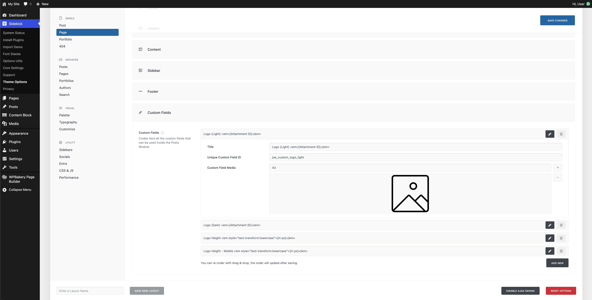
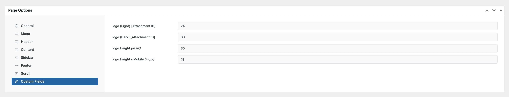

# Uncode Sidekick
This is the ultimate Uncode child theme.

## Per Page Custom Logos

### To Enable
To enable custom logos on select pages, posts, or custom post types:

1. Go to the Uncode Theme Options > Post/Page/[Post Type]
2. Add these custom fields:

Title: Logo (Light) <em>[Attachment ID]</em>
Unique Custom Field ID: joe_custom_logo_light
Custom Field Media: {Enter your icon's media ID}

Title: Logo (Dark) <em>[Attachment ID]</em>
Unique Custom Field ID: joe_custom_logo_dark
Custom Field Media: {Enter your icon's media ID}

Title: Logo Height <em style="text-transform:lowercase">[in px]</em>
Unique Custom Field ID: joe_custom_logo_height
Custom Field Media: {Enter your icon's media ID}

Title: Logo Height - Mobile <em style="text-transform:lowercase">[in px]</em>
Unique Custom Field ID: joe_custom_logo_height_mobile
Custom Field Media: {Enter your icon's media ID}

3. Save Changes

### To Implement
To use a custom logo on a page, post, or custom post type, go to its Edit screen, scroll to the Page Options section, and enter your custom logo details in the Custom Fields section.

## Updates
In order to get theme updates, you need Git Updater installed and activated. Find it at https://github.com/afragen/git-updater.

## Screenshots

